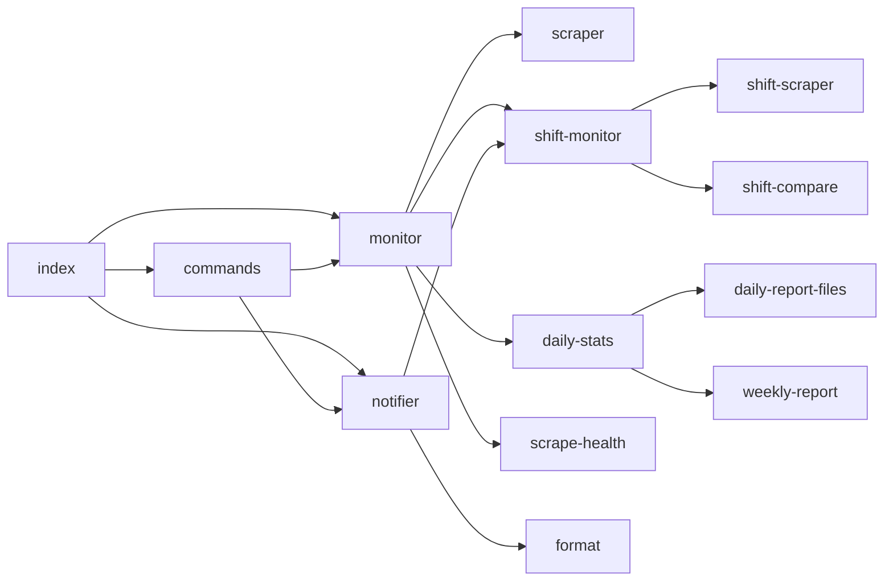

# 01. アーキテクチャ

## ディレクトリ構成

```
X77live/
├── index.js                 # Bot-Hosting エントリ（src/index.js を import）
├── package.json
├── .env.example
├── bot-hosting.env.example
├── BOT-HOSTING.md
├── docs/                    # 本仕様書
├── scripts/
│   ├── register-commands.js # 手動スラッシュコマンド登録
│   ├── invite-url.js
│   └── sftp-pull-reports.sh
├── src/
│   ├── index.js             # メイン起動
│   ├── store.js             # config.json I/O
│   ├── monitor.js           # 2分監視ループ
│   ├── scraper.js           # x77 + dgdgdg 取得
│   ├── notifier.js          # 定期通知
│   ├── format.js            # Embed 生成
│   ├── business-hours.js    # 営業時間・sessionKey
│   ├── shift-scraper.js     # EX / dgdgdg シフト
│   ├── shift-compare.js     # シフト照合ロジック
│   ├── shift-monitor.js     # シフトチェック orchestrator
│   ├── daily-stats.js       # 稼働分集計 + 01:00 サマリー
│   ├── daily-report-files.js
│   ├── weekly-report.js
│   ├── report-backup.js     # 営業中スナップショット
│   ├── config-backup.js
│   ├── scrape-health.js     # 連続失敗アラート
│   ├── bot-liveness.js      # 監視停止検知
│   ├── instance-lock.js     # 二重起動防止
│   ├── commands.js          # コマンド処理
│   ├── slash-commands.js    # Discord コマンド定義
│   ├── auth.js              # パスワード・セッション
│   ├── config.js            # 設定キー・quiet hours
│   ├── admin-notify.js      # 管理者 DM
│   ├── health.js            # HTTP ヘルスチェック
│   └── restart.js           # プロセス再起動
├── test/                    # node:test
└── data/                    # 実行時データ（gitignore）
    ├── config.json
    ├── bot.instance.lock
    ├── backups/
    └── reports/
```

## 起動シーケンス

`src/index.js` の `ClientReady` 時:

```
1. initCommands(client)
2. startMonitor()              … 2分スクレイプ
3. startDailySummaryScheduler() … 60秒 tick → 01:00 サマリー
4. startReportBackupScheduler() … 60秒 tick → 3時間ごとバックアップ
5. startConfigBackupScheduler() … 60秒 tick → 3時間ごと config 保存
6. startBotLivenessScheduler()  … 60秒 tick → 死活監視
7. startNotifier()              … 10分定期通知（notifyEnabled 時）
8. registerSlashCommands()      … Discord REST API
```

起動前:

- `DISCORD_TOKEN` 検証
- `acquireInstanceLock()` … 同一 DATA_DIR で二重起動を拒否
- `startHealthServer()` … `PORT`（デフォルト 8080）で `ok` 返却

## 監視1サイクル（runScrape）

```
runScrape()
  ├─ 営業時間外？ → スキップ（force 時は続行）
  ├─ scrapeOsakaStatuses()
  │    ├─ dgdgdg list.php（ロスター）
  │    └─ x77 liverlist.php（ページング）
  ├─ detectNewBoys / detectChanges
  ├─ applyScrapeResult → config 更新
  ├─ tickDailyStats()（営業時間内のみ集計）
  ├─ 新規ボーイ通知 / ステータス変更通知
  ├─ handleScrapeSuccess / Failure
  ├─ markBotLivenessHealthy()
  └─ runShiftCheck()（営業時間内）
```

## 定期通知1サイクル（sendPeriodicNotification）

```
sendPeriodicNotification()
  ├─ notifyEnabled / notifyChannelId 確認
  ├─ 営業時間外？ → スキップ
  ├─ quiet hours？ → スキップ
  ├─ 重複送信？（lastNotifyAt） → スキップ
  ├─ runShiftCheck()（最新シフト照合）
  ├─ オンライン0 & シフト不一致0？ → スキップ
  └─ buildNotificationEmbed → channel.send()
```

## モジュール依存（主要）



## 永続化

| ファイル | 更新タイミング |
|----------|---------------|
| `config.json` | スクレイプ成功/失敗、コマンド実行、通知送信、バックアップ |
| `reports/*.json/csv` | 01:00 日次、途中バックアップ、手動 `/レポート取得` |
| `backups/config-*.json` | 3時間ごと、手動復元前 |
| `bot.instance.lock` | 起動時作成、終了時削除 |

## スケジューラ一覧

| モジュール | 内部 tick | 実際の動作 |
|-----------|-----------|-----------|
| `monitor.js` | `pollIntervalMinutes` | スクレイプ |
| `notifier.js` | `notifyIntervalMinutes` | 定期 Embed |
| `daily-stats.js` | 60秒 | 01:00±5分で日次サマリー |
| `report-backup.js` | 60秒 | 営業中 3時間ごと |
| `config-backup.js` | 60秒 | 3時間ごと |
| `bot-liveness.js` | 60秒 | lastScrapeAt  stale 検知 |

## 既知の未使用・レガシー

| 項目 | 状態 |
|------|------|
| `settings.shiftAlertEnabled` | config に保存されるが **参照されない**（PR #24 以降、シフト不一致は定期 Embed のみ） |
| `shiftAlertState` | 同上、未使用 |
| `config.isAdmin()` / `adminRoleIds` | 定義のみ。認証は **パスワード/セッションのみ** |
| README の「シフト外即時通知 30分クールダウン」 | **実装から削除済み**（README は未更新） |
